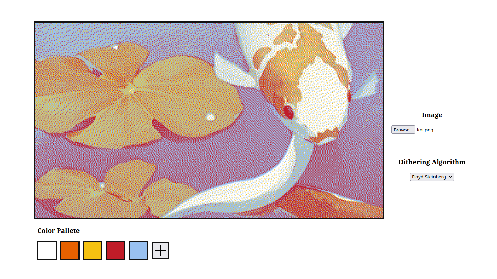

# Dithering Easily Run in Your Browser

## Available Algorithms
1. Nearest Neighbour
2. Floyd-Steinberg

## Getting Started
It's as easy as opening `dist/index.html` in your browser. All scripts are already compiled and bundled.

## Starting from Scratch
1. Install all npm dependencies with `npm install`
2. Compile TypeScript and bundle using Webpack: `npx webpack`
3. Open `dist/index.html` in your browser

